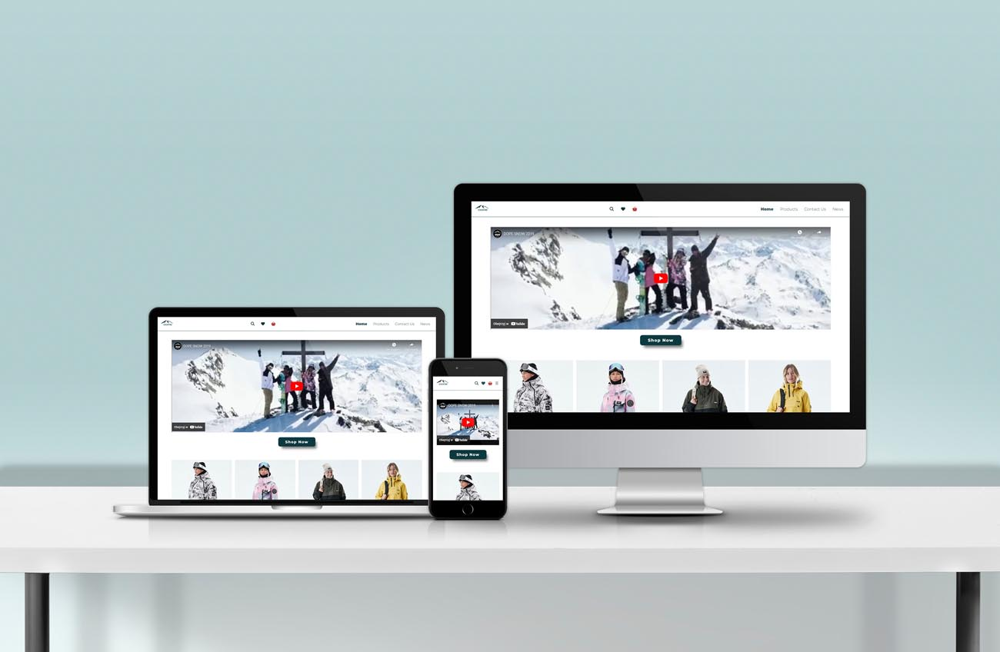

# Dope - Cross Course Project

<p align="center">

</p>

## Description

You need to deliver a properly functioning, responsive website for the assignment brief that you chose in Design 1 (Rainy Days).

The website should be responsive and look good at every screen size with no horizontal scrollbars. Use Flexbox and CSS Grids where appropriate. Please do not use a CSS framework like Bootstrap, we want to see that you can build responsive sites without the help of a framework.

### Project requirements

The site needs to have every page listed in the site architecture on your chosen brief(Rainy Days).

- Home
- List of Jackets
- A jacket specific page showing the jacket
- A checkout page
- A checkout success
- About
- Contact

## Built With


## Getting Started

### Installing

1. Clone the repo:

```bash
git clone git@github.com:KarolinaSzymanska899/Dope.git
```

2. Install the dependencies:

```
npm install
```

### Running

Using the liveServer extension for VScode:

Right click on the index.html and click view in live server. This will open [http://localhost:3000](http://localhost:3000) in your browser where you can see the result.

## Contact

[](https://www.linkedin.com/in/karolina-szyma%C5%84ska-64b36089/)
